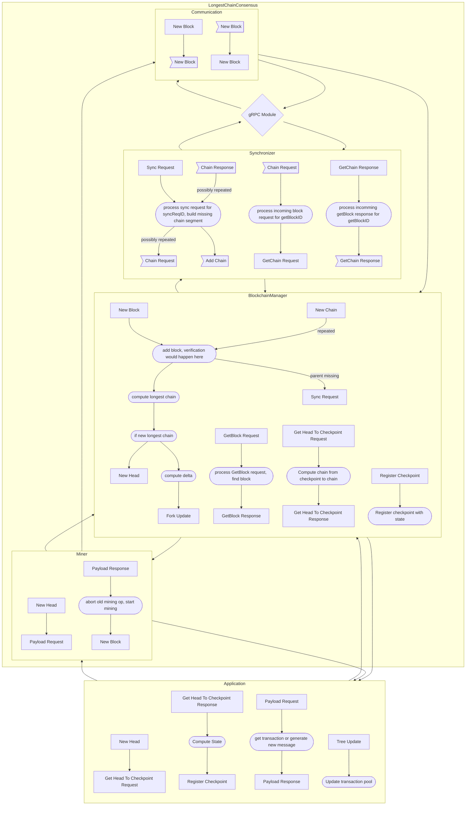

```mermaid
flowchart BT;

subgraph LongestChainConsensus

    subgraph BlockchainManager
    direction TB;

    nbi[New Block] --> ab([add block, verification would happen here])
    nci[New Chain] --repeated--> ab
    ab --> clc([compute longest chain])
    ab --parent missing--> sr[Sync Request]
    clc --> inlc([if new longest chain])
    inlc -->  nho[New Head]
    inlc --> cd([compute delta])
    cd --> do[Fork Update]

    gbi[GetBlock Request] --> pgbr([process GetBlock request, find block])
    pgbr --> gbo[GetBlock Response]

    bcmghtcri[Get Head To Checkpoint Request] --> cctc([Compute chain from checkpoint to chain])
    cctc --> bcmghtcro[Get Head To Checkpoint Response]

    rc[Register Checkpoint] --> rcws([Register checkpoint with state])

    end

    subgraph Miner
    direction TB;

    nh[New Head] --> mpro[Payload Request]
    mpri[Payload Response] --> m([abort old mining op, start mining])
    m --> nbio[New Block]
    end

    subgraph Communication
    c_nbo[New Block] --> nbfo>New Block]
    c_nbfi>New Block] --> c_nbi[New Block]
    end

    subgraph Synchronizer
    sri[Sync Request] --> psr([process sync request for syncReqID, build missing chain segment])
    psr --possibly repeated--> creqo>Chain Request]
    cresi>Chain Response] --possibly repeated--> psr
    psr --> ac>Add Chain]

    creq>Chain Request] --> picr([process incoming block request for getBlockID])
    picr --> gcreq[GetChain Request]
    gcRes[GetChain Response] --> picres([process incomming getBlock response for getBlockID])
    picres --> bres>GetChain Response]

    end

    grpc{gRPC Module}
end

subgraph Application
nhi[New Head] --> aghtcro[Get Head To Checkpoint Request]
aghtcri[Get Head To Checkpoint Response] --> cs([Compute State])
cs --> rco[Register Checkpoint]

pri[Payload Request] --> gp([get transaction or generate new message])
gp --> pro[Payload Response]
di[Tree Update] --> utp([Update transaction pool])
end

grpc --> Communication
Communication --> grpc
Miner --> Application
Application --> Miner
Miner --> BlockchainManager
BlockchainManager --> Miner
Miner --> Communication
Application --> BlockchainManager
BlockchainManager --> Application
Communication --> BlockchainManager
BlockchainManager --> Synchronizer
Synchronizer --> BlockchainManager
Synchronizer --> grpc
grpc --> Synchronizer
```
