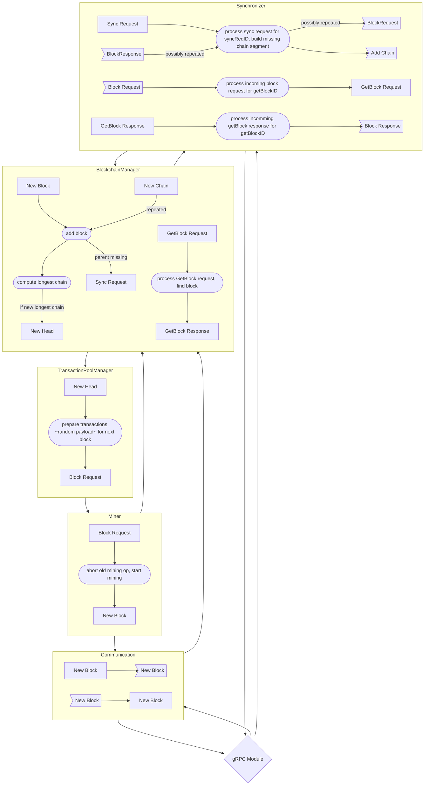

```mermaid
flowchart TB;

subgraph TransactionPoolManager
direction TB;

nhi[New Head] --> pt([prepare transactions ~random payload~ for next block])
pt --> bro[Block Request]
end

subgraph BlockchainManager
direction TB;

nbi[New Block] --> ab([add block])
nci[New Chain] --repeated--> ab
ab --> clc([compute longest chain])
ab --parent missing--> sr[Sync Request]
clc -->|if new longest chain| nho[New Head]

gbi[GetBlock Request] --> pgbr([process GetBlock request, find block])
pgbr --> gbo[GetBlock Response]

end

subgraph Miner
direction TB;

bri[Block Request] --> m([abort old mining op, start mining])
m --> nbio[New Block]
end

subgraph Communication
c_nbo[New Block] --> nbfo>New Block]
c_nbfi>New Block] --> c_nbi[New Block]
end

subgraph Synchronizer
sri[Sync Request] --> psr([process sync request for syncReqID, build missing chain segment])
psr --possibly repeated--> breqo>BlockRequest]
bresi>BlockResponse] --possibly repeated--> psr
psr --> ac>Add Chain]

breq>Block Request] --> pibr([process incoming block request for getBlockID])
pibr --> gbreq[GetBlock Request]
gbRes[GetBlock Response] --> pibres([process incomming getBlock response for getBlockID])
pibres --> bres>Block Response]

end

grpc{gRPC Module} --> Communication
Communication --> grpc
Miner --> BlockchainManager
BlockchainManager --> TransactionPoolManager
TransactionPoolManager --> Miner
Miner --> Communication
Communication --> BlockchainManager
BlockchainManager --> Synchronizer
Synchronizer --> BlockchainManager
Synchronizer --> grpc
grpc --> Synchronizer
```
