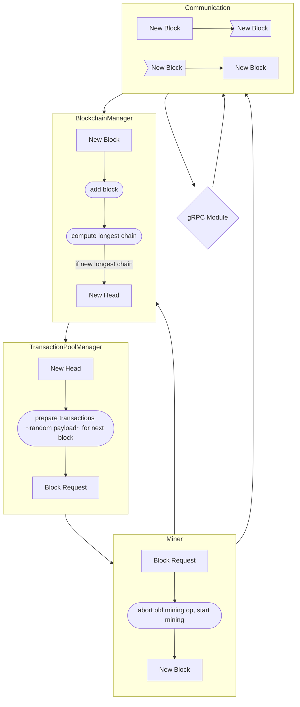

```mermaid
flowchart TB;

subgraph TransactionPoolManager
direction TB;

nhi[New Head] --> pt([prepare transactions ~random payload~ for next block])
pt --> bro[Block Request]
end

subgraph BlockchainManager
direction TB;

nbi[New Block] --> ab([add block])
ab --> clc([compute longest chain])
clc -->|if new longest chain| nho[New Head]

end

subgraph Miner
direction TB;

bri[Block Request] --> m([abort old mining op, start mining])
m --> nbio[New Block]

end
subgraph Communication
c_nbo[New Block] --> nbfo>New Block]
c_nbfi>New Block] --> c_nbi[New Block]
end

grpc{gRPC Module} --> Communication
Communication --> grpc
Miner --> BlockchainManager
BlockchainManager --> TransactionPoolManager
TransactionPoolManager --> Miner
Miner --> Communication
Communication --> BlockchainManager
```
